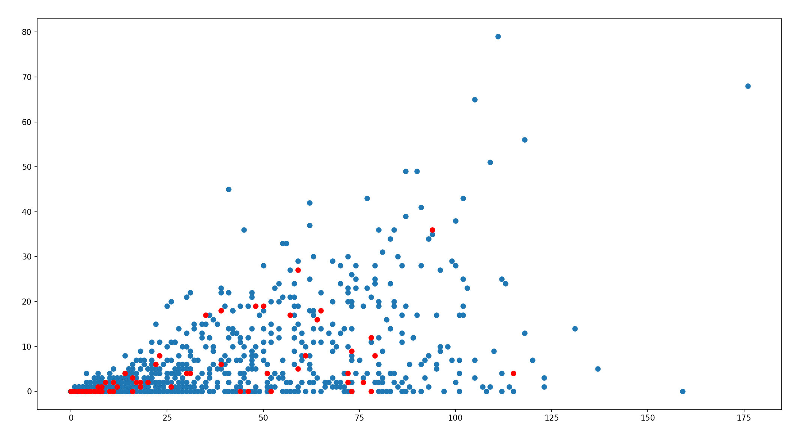
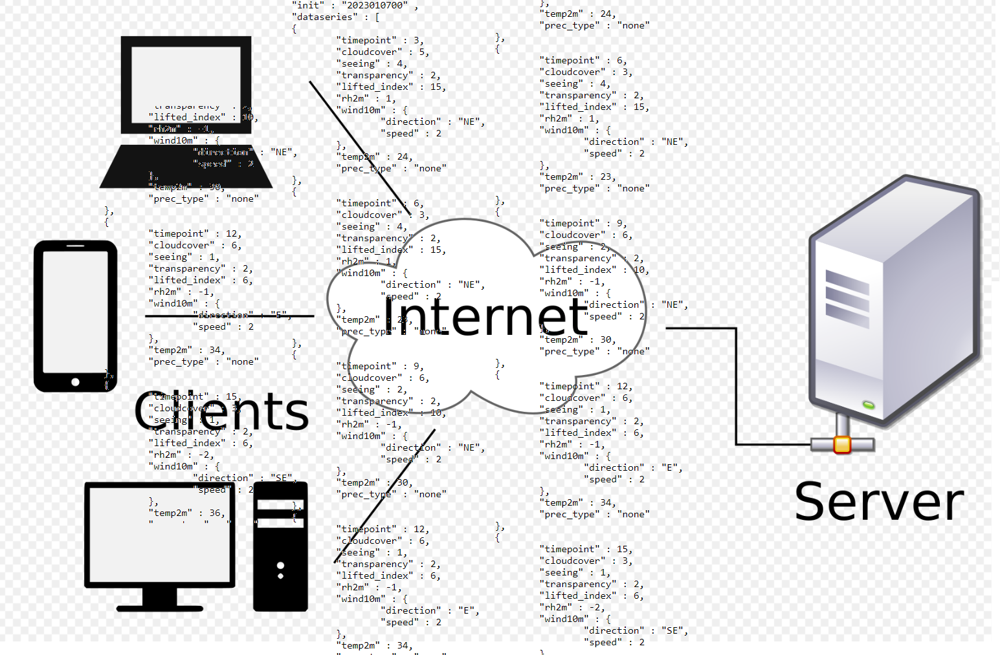
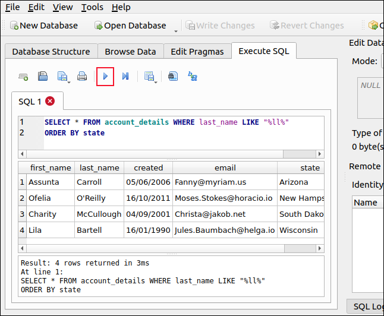

# Preview

We'll be building programs that show information visually, programs that read data from the internet, and programs that interact with databases.

We'll learn how to track down errors in our code and how to investigate code that other people have written.

A big part of the course will be something called object-oriented programming - a way to structure your program to make it more organized and easier to change in the future.

<image src="../../images/w1/oop.jpg" height="50%" width="50%" style="border:none, border-width: 0, border: 0; box-shadow: 0px 0px;" />

For our final project we'll write an object-oriented game that can save and resume its progress.

### Details

In this course we'll build off of what we learned in Programming 1. We will use the tools we've learned to build more advanced programs: programs that display information visually, read from the internet, and interact with databases. We'll deepen our knowledge of software fundamentals - learning about object-oriented software, how to recover from errors, and how data is structured. Finally, we will begin to explore the philosophy of writing software. This means going beyond "does my program compute the right thing", but to ask questions like if is the program well-organized, if it will be readable by other programmers, and if it will it be re-usable in other projects.

At the end of the course we will be able to be comfortable writing Python programs to accomplish basic tasks, and to write tests to check that the code is working correctly. We will understand what objects and classes are (in other words, writing object-oriented programs). Along the way we'll pick up tips on how to investigate programs that aren't working correctly, and we'll gain experience reading and understanding code that other people have written. Everything in the course will be truly valuable for doing real-world work in the field.

<image src="../../images/w1/ttt.png" height="50%" width="50%" style="border:none, border-width: 0, border: 0; box-shadow: 0px 0px; margin-top:1em" />
