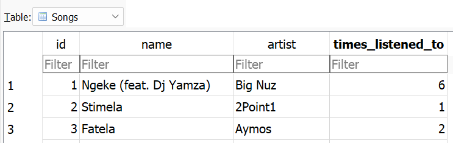

# Persisting Data

Recall that persisting data means to save it in a way that lasts after the program exits. In the past, you've persisted data by saving it as a file, usually in JSON format. For instance, the [Persisted List](/lessons/inheritance-and-error-handling/inheritance.html) example saved data in this fashion.

In that program, we moved from a simpler program that wrote the list as lines in a text file, to a slightly-more-complicated program that wrote the list in a JSON format. Although the program got more complicated, there were benefits to using JSON:

 * it handles structures better. The version that persisted lists as lines in a file, didn't work if one of the list items contained more than one line.
 * you no longer need to write code to turn dictionaries into strings, and strings back into dictionaries.
 * JSON is a format that web APIs often use, so if your program can read and write json it can be quickly adapted to connect with a web API.

Saving data into a database is similar - the code will be more complicated, but there will be benefits.

### Part 1: Song List, JSON

Imagine that you're working on a program that keeps track of what music we listen to. You have a long list of songs and a counter of how many times they have been played. The data looks like this:

```json
{
    "songs": [
        {
            "id": 1,
            "name": "Ngeke (feat. Dj Yamza)",
            "artist": "Big Nuz",
            "times_listened_to": 6
        },
        {
            "id": 2,
            "name": "Stimela",
            "artist": "2Point1",
            "times_listened_to": 1
        },
        {
            "id": 3,
            "name": "Fatela",
            "artist": "Aymos",
            "times_listened_to": 2
        }
    ]
}
```

You have a short program that can increase the `times_listened_to` for a song.

```python
import json

class SongListUsingJson:
    def __init__(self, filename):
        self.filename = filename
        with open(self.filename, encoding='utf-8') as f:
            self.data = json.load(f)
    
    def save(self):
        with open(self.filename, 'w', encoding='utf-8') as f:
            json.dump(self.data, f, indent=4)
            
    def get_song_id(self, song_name):
        for song in self.data['songs']:
            if song['name'] == song_name:
                return song['id']
                
        print('Song not found')
        return None
        
    def show_times_listened_to(self, song_id):
        for song in self.data['songs']:
            if song['id'] == song_id:
                times_listened_to = song['times_listened_to']
                print(f"You've listened to the song {times_listened_to} times")
                return times_listened_to
        
        print('Song not found')
        return None
        
    def increase_times_listened_to(self, song_id):
        for song in self.data['songs']:
            if song['id'] == song_id:
                song['times_listened_to'] += 1
                self.save()
                return
        
        print('Song not found')
        
    def update_song_name(self, song_id, name):
        for song in self.data['songs']:
            if song['id'] == song_id:
                song['nme'] = name
                self.save()
                return
        
        print('Song not found')
```

The program is written in a nice object-oriented way, so it can be used pretty easily:

```python
song_list = SongListUsingJson('songs-kibo.json')
song_id = test.get_song_id('Fatela')
song_list.increase_times_listened_to(songid)
song_list.update_song_name(songid, 'Fatela 2')
```

This mostly works...

However, there is a bug in the program!

<details><summary>Do you see the problem in `update_song_name`?</summary>

```python
def update_song_name(self, song_id, name):
        for song in self.data['songs']:
            if song['id'] == song_id:
                song['nme'] = name
                self.save()
                return
        
        print('Song not found')
```

The update has a typo! The code has the string `'nme'` instead of `'name'`.


</details>

### Typos

The program does not show any errors when it runs. However, because there was a typo, the update function updates the `'nme'` value, instead of `'name'`, so it didn't work as intended. 

This is an especially frustrating type of problem, because there wasn't any visible error to see that something went wrong.

This is a downside of using dictionaries and JSON to persist data. A typo like this isn't always visible, because `'nme'` is still a valid dictionary key. JSON has no way of knowing which field names are correct and incorrect. It doesn't know that `"name"` is right and `"nme"` is wrong.

### Part 2: Song List, Database

<aside> 
You have used databases in the Web App Development course.

This week we will be using Sqlite databases. Sqlite saves data to a single file, which can be right next to your code, for simplicity. Sqlite is widely used, and it is built into Python. That means you don't need to install anything extra to use it.

We'll skip over setting up the database. Here, we'll focus on communicating to the database from Python. Refer to the Web Applications course to review database setup. 
</aside>

A database works well for the Songs program, because the data was already laid out in a list. The database table we'll use has a **table** named Songs, with **columns** `id`, `name`, `artist`, and so on. Each entry in the list we is a **row** that represents one song.



Here's an example illustrating how to interact with the Songs database from Python:

```python
import json
import sqlite3

def get_song_id_db(dbfile, song_name):
    conn = sqlite3.connect(dbfile)
    cursor = conn.execute("SELECT id FROM Songs WHERE name=?", [song_name])
    row = cursor.fetchone()
    if row:
        id = row[0]
        return id
    else:
        print('Song not found')
   
def increase_times_listened_to_db(dbfile, song_id):
    conn = sqlite3.connect(dbfile)
    cursor = conn.execute("UPDATE Songs SET times_listened_to = times_listened_to + 1 WHERE id=?", [song_id])
    if not conn.total_changes:
        print('Song not found')
        
    conn.commit()
    
def update_song_name_db(dbfile, song_id, song_name):
    conn = sqlite3.connect(dbfile)
    cursor = conn.execute("UPDATE Songs SET nme = ? WHERE id=?", [song_name, song_id])
    if not conn.total_changes:
        print('Song not found')
        
    conn.commit()

```

The `conn` variable is called a connection object.

You'll recognize that the program sends SQL to communicate with the database. It builds a string of SQL and sends it to the database using the `execute` method. The `?` marks a slot in the query that will be replaced by parameters.

The db file for this example can be found here: [songs-kibo.db](https://github.com/kibo-programming-2-jan-23/walkthroughs/blob/main/db-and-vis/songs-kibo.db).

This code has the same typo as the previous program. However, when the database version runs, `update_song_name` fails with an error. There is no column named `nme`, so the program stops right away. This is a small advantage that using a database has over using a json file.

Note: When inserting or updating data using SQLite, you need to call `.commit()` to persist any database changes. `execute` only updates the data in memory, it doesn't flush the updates to disk.
