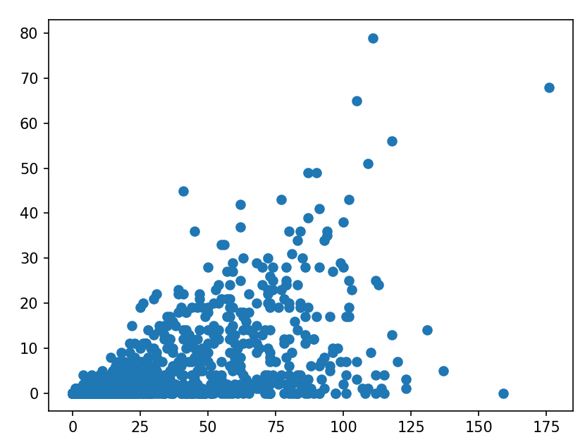
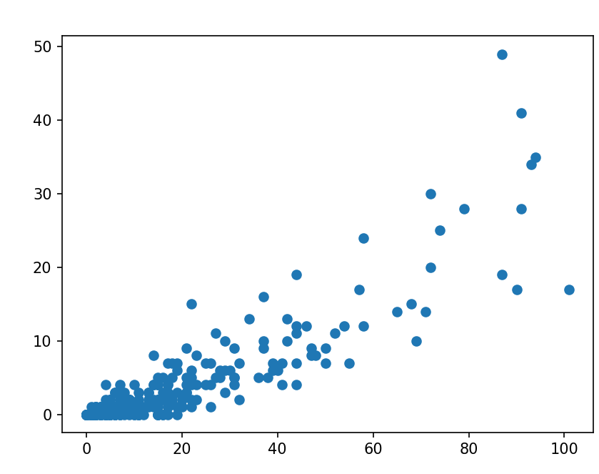

# Visualizing Data

Charts, graphs, and other illustrations help people understand data better than looking at rows of names and numbers.

In Python, there are a few tools that can be used to visualize data. This week we'll use a library called `matplotlib`.

> **Install matplotlib**
>
> `matplotlib` is an external package. You can install it using pip.

## Further Reading: What is data visualization?

See <a href="https://careerfoundry.com/en/blog/data-analytics/what-is-data-visualization/">this article from CareerFoundry</a> for an introduction to Data Visualization.

<a href="https://careerfoundry.com/en/blog/data-analytics/what-is-data-visualization/"></a>

## Histograms

A histogram depicts trends in data. It shows how frequently values fall into certain ranges. For example, let's say you want to know the most common song length for popular music. Are most popular songs about 4 minutes long?

We can answer the question by drawing a histogram.

Histograms are explained on the page [here](https://www.tibco.com/reference-center/what-is-a-histogram-chart).

We can add a script alongside our previous exploration scripts, that uses matplotlib and the existing scripts to draw a histogram.

This example creates a histogram of song lengths:

```python
import matplotlib.pyplot as pyplot
from pop_charts_exploration import *

def get_durations():
    durations = []
    exploration = PopChartsExploration('pop_charts_exploration.db')
    songs = exploration.session.query(PopCharts).all()
    for song in songs:
        durations.append(song.duration)
    
    return durations

def song_length_histogram():
    number_of_bins = 20
    durations = get_durations()

    pyplot.hist(durations, bins=number_of_bins)
    pyplot.show()
        
if __name__ == '__main__':
    song_length_histogram()
```

The `get_durations` function uses sqlalchemy to get a list of the length in seconds of each song. This list of numbers is passed to matplotlib's `pyplot.hist`, which decides which numbers go in which _bins_ and draws the graph.

**Try it**: Run the code. Looking at the graph, how long are most songs in the data set?

## Scatter Plots

Scatter plots can show the **correlation** between data. This means that there is a connection between the two types of statistical event.

For example, there is a correlation between a number of shots on goal, and how often a football team wins. They aren't 100% correlated, because sometimes a team could take a lot of wild shots and not win the game. But in general, taking a lot of shots means a team is more likely to win.

Sometimes, there isn't a correlation between events. For example, one could try to find a correlation between the color of the team uniform and how often a football team wins. There probably wouldn't be a very strong correlation.

It's very interesting to ask questions about correlation. It can help us, for example, determine how much advantage there is to playing at home.

[This page](https://docs.tibco.com/pub/sfire-analyst/latest/doc/html/en-US/TIB_sfire-analyst_UsersGuide/scat/scat_what_is_a_scatter_plot.htm#:~:text=Scatter%20plots%20are%20used%20to,the%20X%20and%20Y%20axes.) describes **scatter plots** in more detail.

Let's create a scatter plot using the Football Player database.

```python
import matplotlib.pyplot as pyplot
from football_players_exploration import *

def caps_and_goals():
    caps = []
    goals = []
    exploration = FootballPlayersExploration('football_players_exploration.db')
    players = exploration.session.query(Player).all()
    # make two lists
    # one of each player's number of appearances (caps)
    # the other of each player's number of goals
    for player in players:
        caps.append(player.caps)
        goals.append(player.goals)
    
    return caps, goals
    
def make_scatter_plot():
    caps, goals = caps_and_goals()
    pyplot.scatter(caps, goals)
    pyplot.show()
    
if __name__ == '__main__':
    make_scatter_plot()
```

This plot is with caps (appearances) on the x axis and goals on the y axis. There is a weak relationship. A strong correlation would show a straight line, and this is more of a cloud: it's not a strong correlation. This means that scoring more goals is linked to appearing more, but it's not a very strong link.



What if we filter to only look at Forwards?

```python
import matplotlib.pyplot as pyplot
from football_players_exploration import *

def caps_and_goals(position):
    caps = []
    goals = []
    exploration = FootballPlayersExploration('football_players_exploration.db')
    players = exploration.session.query(Player).filter(Player.position==position).all()
    for player in players:
        caps.append(player.caps)
        goals.append(player.goals)
    
    return caps, goals
    
def make_scatter_plot(position):
    caps, goals = caps_and_goals(position)
    pyplot.scatter(caps, goals)
    pyplot.show()
    
if __name__ == '__main__':
    make_scatter_plot(position='FW')

```



There is a stronger correlation. The data is shaped in more of a line than a cloud. This makes sense! Forwards score more goals than other players, so caps should be more strongly correlated with goals.

## Try it yourself: Scatter plots

Make scatterplots for goals vs caps for different positions.

* Look at the player data in the database and get the codes for different positions. Hint: `FW` is for forward, `GK` for goalkeeper.
* Modify the script above, to make plots for each position.

Which position has the strongest correlation between caps and goals? Which position has the weakest correlation?
