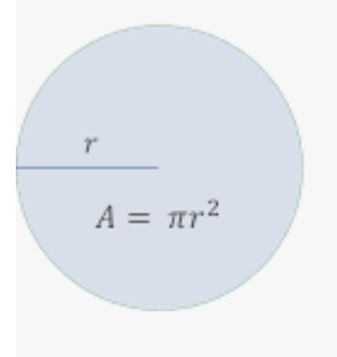

# Exercises

---

> 💡 This is your chance to put what you’ve learned into action.

### Submission

> **[Use this form](https://forms.gle/UbWLpo86JsWxrpNe9)**

You are required to submit documentation for 10 exercises over the
course of the term. Each one will count for 1%
of your overall grade.

* You are welcome to log work that is not one of the exercises listed on the 
exercises page.
* You can submit a link to a github repo, a replit, a Google doc, or some other 
resource.

Your log will count for credit as long as it:
- is accessible to your instructor
- shows your own work

Because there is also a project this week, there are only two exercises on this page.

## Circle (Handling Exceptions) (1 point)

<!-- https://github.com/kibo-programming-2-jan-23/circle-handle-exceptions-exercise
 -->
 
* Please edit main.py
* Write a short script to show the area of a circle
    * First ask the user to type in a number for radius, by using `input()`
    * Use `float()` to convert what the user typed into a decimal number
    * Then, compute and show the area, which is pi * radius * radius
    

* If the user does not type in a number, for example if they type in letters, show the message "not a number" and exit.
    * Hint: this is an example of exception handling.
    * `try` and `except` will be useful tools.
    
## PersistedList Reset (Inheritance) (1 point)

<!-- https://github.com/kibo-programming-2-jan-23/persisted-list-reset-exercise -->

* Please edit main.py
* Create a child class of the `PersistedList` class called `ResetablePersistedList`.
* Add a method on that child class called `reset()`. It should set the current list to `[]` (an empty list).

## Submitting an assignment

When you are done, `commit` and `push` your code. Submit a link to your work on
Github using this form: **[Programming Exercise log](https://forms.gle/UbWLpo86JsWxrpNe9)**.

Be sure that the link you submit will take the instructor directly to your code.

<aside>

**If you get stuck**
1. Read the instructions again.
2. Remember **G**o **C**limb **K**ibo - first Google, then ask the Community on Discord, then reach out to Kibo instructional team.

</aside>

