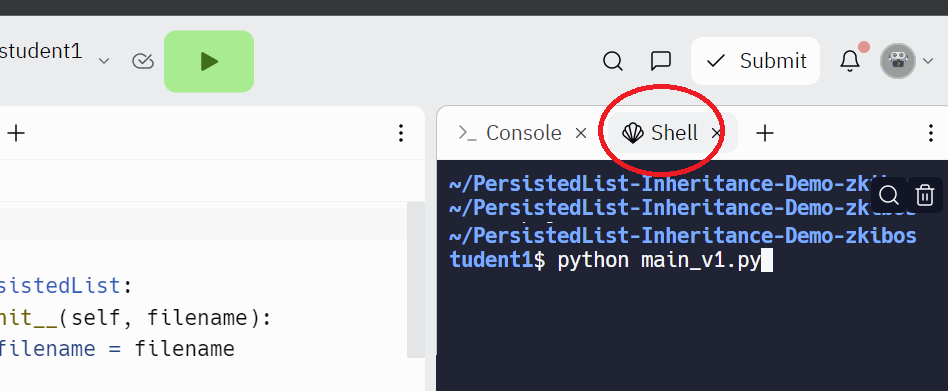

# Inheritance

For the case where you have a program that needs to run in different modes, let's learn a way to write better code.

Let's say we have a program that needs to save data to disk. For example, this could be a list of student names used by a course enrollment manager program. When the program starts, it loads the list from the file on disk. When the program makes changes to the list, the changes need to be saved.

In this case, imagine that instead of waiting for the user to select some Save feature, or instead of waiting for the program to exit, we want the data to automatically be saved on every change.

This would be a great case for writing a class. We are used to using `list` objects, we use them all of the time. We can create a class to make objects that are similar to lists, so that they are easy to use + have the append method we are used to, but they also save the contents.

> [**Click here to follow along on Replit!** ](https://replit.com/team/kibo-programming-2/PersistedList-Inheritance-Demo) Please sign up for an account and request to join the team if you haven't already.

> Once you are in Replit, click `Shell` on the right and type in a script like `python main_v1.py` to run one of the scripts.

> 


```python
# main_v1.py

class PersistedList:
  def __init__(self, filename):
    self.filename = filename
    
    if os.path.exists(filename):
      with open(self.filename, 'r') as f:
        file_contents = f.read()
        self.internal_list = file_contents.split('\n')
    else:
      self.internal_list = []

  def append(self, incoming_string):
    self.internal_list.append(incoming_string)
    with open(self.filename, 'w') as f:
      new_file_contents = '\n'.join(self.internal_list)
      f.write(new_file_contents)
    
  def insert(self, position, incoming_string):
    self.internal_list.insert(position, incoming_string)
    with open(self.filename, 'w') as f:
      new_file_contents = '\n'.join(self.internal_list)
      f.write(new_file_contents)
  
  def get_last_item(self):
    length = len(self.internal_list)
    return self.internal_list[length - 1]
  
  def get_item_at(self, position):
    return self.internal_list[position]
  
  def set_item_at(self, position, incoming_string):
    self.internal_list[position] = incoming_string
    with open(self.filename, 'w') as f:
      new_file_contents = '\n'.join(self.internal_list)
      f.write(new_file_contents)
        
```

This code does work, but it's not as good as it could be.

Let's add some improvements. There is some repeated code. We can add a helper method to reduce the repetition.

We don't expect outside users of the class to need to call this `persist()` method. It's an internal method to help the other methods work.

```python
# main_v2_helper.py

class PersistedList:
  def __init__(self, filename):
    self.filename = filename
    
    if os.path.exists(filename):
      with open(self.filename, 'r') as f:
        file_contents = f.read()
        self.internal_list = file_contents.split('\n')
    else:
      self.internal_list = []
      
  def persist(self):
    with open(self.filename, 'w') as f:
      new_file_contents = '\n'.join(self.internal_list)
      f.write(new_file_contents)
    
  def append(self, incoming_string):
    self.internal_list.append(incoming_string)
    self.persist()
    
  def insert(self, position, incoming_string):
    self.internal_list.insert(position, incoming_string)
    self.persist()
  
  def get_last_item(self):
    length = len(self.internal_list)
    return self.internal_list[length - 1]
  
  def get_item_at(self, position):
    return self.internal_list[position]
  
  def set_item_at(self, position, incoming_string):
    self.internal_list[position] = incoming_string
    self.persist()
```

The program doesn't work, though, if one of the items has a newline (\n) character in it. We can make a new version of the persistedlist that saves to `json`, which is a good way of solving the problem. Imagine that we still need to keep the original PersistedList around though, because there are older parts of the program that still need to use that format.

> In professional software development, *backwards compatibility* is something to be aware of. If this is a program running on a customer's device, it can be hard to change the way data is stored on disk, even if it's not stored in the best way. This is because customers on their own devices will already have a lot of data stored in the old format.

```python
# main_v3_two_classes.py

import os
import json

class PersistedListIntoLines:
  def __init__(self, filename):
    self.filename = filename
    
    if os.path.exists(filename):
      with open(self.filename, 'r') as f:
        file_contents = f.read()
        self.internal_list = file_contents.split('\n')
    else:
      self.internal_list = []
      
  def persist(self):
    with open(self.filename, 'w') as f:
      new_file_contents = '\n'.join(self.internal_list)
      f.write(new_file_contents)
    
  def append(self, incoming_string):
    self.internal_list.append(incoming_string)
    self.persist()
    
  def insert(self, position, incoming_string):
    self.internal_list.insert(position, incoming_string)
    self.persist()
  
  def get_last_item(self):
    length = len(self.internal_list)
    return self.internal_list[length - 1]
  
  def get_item_at(self, position):
    return self.internal_list[position]
  
  def set_item_at(self, position, incoming_string):
    self.internal_list[position] = incoming_string
    self.persist()

class PersistedListIntoJson:
  def __init__(self, filename):
    self.filename = filename
    
    if os.path.exists(filename):
      with open(self.filename, 'r') as f:
        self.internal_list = json.load(f)
    else:
      self.internal_list = []
      
  def persist(self):
    with open(self.filename, 'w') as f:
      json.dump(self.internal_list, f)
    
  def append(self, incoming_string):
    self.internal_list.append(incoming_string)
    self.persist()
    
  def insert(self, position, incoming_string):
    self.internal_list.insert(position, incoming_string)
    self.persist()
  
  def get_last_item(self):
    length = len(self.internal_list)
    return self.internal_list[length - 1]
  
  def get_item_at(self, position):
    return self.internal_list[position]
  
  def set_item_at(self, position, incoming_string):
    self.internal_list[position] = incoming_string
    self.persist()
```

Our program is pretty long, now, and there's again repeated code.

It turns out that, in Python, there is something called **class inheritance**. 

A class can **inherit** from another class, which means that it will get a copy of all of the methods. This is what it looks like:

```python
# main_v4_inheritance.py

import os
import json

class PersistedListGeneral:
  def append(self, incoming_string):
    self.internal_list.append(incoming_string)
    self.persist()
    
  def insert(self, position, incoming_string):
    self.internal_list.insert(position, incoming_string)
    self.persist()
  
  def get_last_item(self):
    length = len(self.internal_list)
    return self.internal_list[length - 1]
  
  def get_item_at(self, position):
    return self.internal_list[position]
  
  def set_item_at(self, position, incoming_string):
    self.internal_list[position] = incoming_string
    self.persist()
  
class PersistedListIntoLines(PersistedListGeneral):
  def __init__(self, filename):
    self.filename = filename
    
    if os.path.exists(filename):
      with open(self.filename, 'r') as f:
        file_contents = f.read()
        self.internal_list = file_contents.split('\n')
    else:
      self.internal_list = []
      
  def persist(self):
    with open(self.filename, 'w') as f:
      new_file_contents = '\n'.join(self.internal_list)
      f.write(new_file_contents)
  

class PersistedListIntoJson(PersistedListGeneral):
  def __init__(self, filename):
    self.filename = filename
    
    if os.path.exists(filename):
      with open(self.filename, 'r') as f:
        self.internal_list = json.load(f)
    else:
      self.internal_list = []
      
  def persist(self):
    with open(self.filename, 'w') as f:
      json.dump(self.internal_list, f)
```

Now, we no longer have the repeated code.

An instance of `PersistedListIntoLines` will still have the `append` and `insert` methods, because it has **inherited** those methods from the GenericPersistedList class.

An instance of `PersistedListIntoJson` will still have the `append` and `insert` methods, because it has **inherited** those methods from the GenericPersistedList class.Inheritance can be used for many purposes. It's often useful when there are two classes that have the same set of methods, but are in different modes and end up implementing the methods differently.

> ### Practice
> Open `main_v4_inheritance.py` in replit. (There is a link to replit at the top of this page).  
> * At the bottom of the file, create an instance of the `PersistedListIntoLines` class that saves into the file "fruit.txt"
> * Use the `append` method to add the string "apples" to the list
> * Use the `append` method to add the string "bananas" to the list
> * (Notice that the append method works even though `PersistedListIntoLines` does not have that method. This is because it is using the method from `PersistedListGeneral`).
> * Open "fruit.txt" and see the contents.

## Terminology

We can think of the GenericPersistedList as the *parent*, and the PersistedListIntoLines class as the *child*. We can use the terms *parent class* and *child class*. 

> Object-oriented programming has been around for decades, and it has been added to very many different programming languages. People sometimes use the different terms for what is essentially the same concept. So instead of *parent class* and *child class*, people will sometimes say *super class* and *sub class*, or *base class* and *derived class*.


