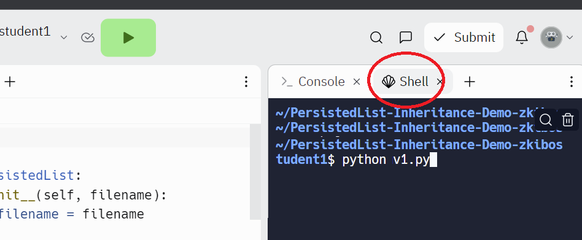

# Overriding Methods

> [**Click here to follow along on Replit!** ](https://replit.com/team/kibo-programming-2/MadLibs-Override-Demo) Please sign up for an account and request to join the team if you haven't already.

> Once you are in Replit, click `Shell` on the right and type in a script like `python main_v1.py` to run one of the scripts.

> 

In this page, we'll be continuing to talk about the case where one class inherits from another class. Remember that inheriting a class will let it use methods from the parent class.

We'll be exploring what happens when a child class defines a method with the same name as a method on the parent class.

## Madlibs

But first, let's go back to a Madlibs example, like the project from Programming 1.Try running this code in replit, and understand how it works. 

## Object-Oriented Madlibs

<!-- 
start with this:

MadlibsWordChooser class
    method getVerb() asks the user
    method getNoun() asks the user

def replacewords

def main
   make an instance MadlibsWordChooser
    play the game
-->

Notice that the game has internal data (the words being chosen, and the template), and behavior (running the game for each word and showing the output).

So the game itself is like an object. It is common in software to have "higher level objects", objects that create and make use of other smaller objects.

<!-- 
refactor to this

MadlibsWordChooser class
    picks from the user

MadlibsGame class
    has  an instance of MadlibsWordChooser

-->

Now, we have a working program that is nicely organized.

There is a feature request that comes in: automatically running the madlibs game by getting a random words. This way you can still have fun running the program on your own without a friend.

<!--
MadlibsWordChooserRandom
    picks from a wordlist
    code is copied
    
MadlibsWordChooserUser
    picks from the user
    code is copied

MadlibsGame class
    has an instance of MadlibsWordChooserRandom or MadlibsWordChooserUser depending on user choice

-->

Let's use inheritance, so that there isn't repeated code,

<!-- 

MadlibsWordChooserGeneric class
    method getVerb()
    method getNoun()

MadlibsWordChooserRandom
    picks from a wordlist
    
MadlibsWordChooserUser
    picks from the user

-->

> Because the methods get copied in, the new class will have essentially the same methods. This means that our game running code in MadlibsGame can call the same methods and doesn't have to worry about if the object is an instance of one class or the other. The code works the same, if given a MadlibsWordChooserRandom or a MadlibsWordChooserUser. We will discuss this more later in the course.

## Overriding

Let's say that we have another feature request. There will be a third mode for the program, which will act like the random word chooser, but for nouns, it will pull data from an internet api. 

Because it is so similar to the MadlibsWordChooserRandom, we want to use inheritence. But we want to leave the getVerb() method the same.

The solution is to make a class that inherits from MadlibsWordChooserRandom. But it will **override** the getNoun() method. It will still get the `getVerb()` but do something else for getNoun.

It will look like this,

<!--
Example here.

-->

## Video

Please continue the video here, from 5 minutes onward,

<iframe src="https://www.youtube.com/embed/C8qE3mKiBrQ?start=325&end=888;rel=0" title="YouTube video player" frameborder="0" allow="accelerometer; autoplay; clipboard-write; encrypted-media; gyroscope; picture-in-picture" allowfullscreen style="position: absolute; top: 0; left: 0; width: 100%; height: 100%;"></iframe>

## Inherited classes are linked

You can visualize a class as being linked to the parent class.

When you call a method on an object, if the method is there it will be run. And if it isn't there, it will follow the link upwards to look for methods that got inherited from the parent class. If the method is there it will be run. (It is only at the end, if the method isn't there, that's when a AttributeNotFound error gets raised.)

A class can inherit from a class that itself inherits from a different class - there can be a link to a link to a link.

> ### Fun fact
> Recall when we talked about types of errors. A DivideByZeroError is a type of RunTimeError whch is a type of general error. Python internally uses inheritance for this!

https://blog.airbrake.io/blog/python/class-hierarchy
