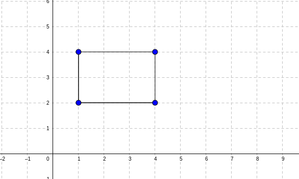

# Practical uses of Classes

## What's the point of a point?

We've built a point class, which we could use to display elements on a grid, but we don't have the tools to do that quite yet. 

However, we can still think of other uses for our class. What can we buid now that we have a definition of a point? We could define a line using two points, or a triangle using three points, a circle using a point and a radius. We could define an arbitrary shape as a list of points. Old school video game programmers relied on this a lot!

Let's see how we can build a simple `Rectangle` class. What we want out of objects of this class is to:
- Display enough information that we can easily picture where our rectange is on a grid.
- Move the rectangle around.
- Check if a point is within the rectangle or not. 

Let's start with our _data_. How would you define the _attributes_ of `Rectangle` objects? Think about it for a few minutes before reading ahead.

There is no one way to make this work, you could provide your constructor with:
- The coordinate of the top-left corner of the rectangle, it's width, and it's length.
- The coordinate of the top-left corner and bottom-right corner of the `Rectangle`

Luckily, we already have a good way of storing coordinates by using our `Point ` class. Let's try and implement the first strategy.

## The Rectangle class

```python
class Rectangle:
	def __init__(self, corner_point, width, height):
		self.top_left_corner = corner_point
		self.width = width
		self.height = height
```

So how would we represent this rectangle? 



We can provide our constructor with a `Point` object, and two numbers for the width and height
```python
my_rectangle = Rectangle(Point(1, 4), 3, 2)

print(my_rectangle.width) # prints 3
print(my_rectangle.height) # prints 2
print(my_rectangle.top_left_corner.x) # prints 1
print(my_rectangle.top_left_corner.y) # prints 4
```

This is an example of **composition**: You can use objects as attributes of other, more complex objects. This helps us leverage all the code we have writen before, as we will see in just a moment. 

For example if we wanted to have a `move_up` method for our rectangle, we could just leverage the fact that we can move a point:

```python
class Rectangle:
	def __init__(self, corner_point, width, height):
		self.top_left_corner = corner_point
		self.width = width
		self.height = height

	def move_up(self):
		self.top_left_corner.move_up()
```

So we can now move up the entire rectangle: 

```python
my_rectangle = Rectangle(Point(1, 4), 3, 2)

print(my_rectangle.top_left_corner.y) # prints 4

my_rectangle.move_up()

print(my_rectangle.top_left_corner.y) # prints 5
```

Notice here that the `Point` class has a method called `move_up`, and so does the `Rectangle` class. This is not an issue though, as Python can tell which definition to use **based on the type of the object the method is called on**.

When we call the `move_up` method on our rectangle, it will then call the `move_up` method of the `Point` class on the specific point that represents our top left corner of the rectangle. 

### Displaying information about classes

We've been accessin attributes of our top left corner using lines like `print(my_rectangle.top_left_corner.x)` What would happen if we just tried to print our top_left_corner directly? 

```python
print(my_rectangle.top_left_corner) 
# outputs <__main__.Point object at 0x7f97f49937c0>
```

That's odd! we see that we are dealing with a `Point` object, which is sensiblle, but then we get this mess of characters. We will dig into what they mean next week, but for now let's focus on how to better present the data.

Turns out, this is such a common problem that python already has a solution for it. the `__str__` method is a special method of a class that lets you define how to convert it to a String. This means that you can define what shows up when you print an instance of that class.

Let's define an `__str__` method for the point class:

```python
class Point:
    def __init__(self, initial_x, initial_y):
        self.x = initial_x
        self.y = initial_y

    def move_right(self):
        self.x += 1
        
    def move_left(self):
        self.x -= 1

    def move_up(self):
        self.y += 1
        
    def move_down(self):
        self.y -= 1

    def __str__(self):
    	return f'({self.x}, {self.y})'
```
With this change, we reap the benefit not only when interacting with `Point` objects directly, but also when using other classes that use `Point` objects.

```python
print(my_rectangle.top_left_corner) # outputs (1, 4)
```
### Check for understanding:
How would you modify the `Rectangle` class so that we can print a `Rectangle` object directly and see meaningful information?

## What's next?

In the next section you will find multiple practice exercises, as well as your first assignment! You will be asked to create increasingly more complex classes and methods.

Next week, we will keep working with classes and objects, unveil the mystery of the numbers that showed up when we print an object, and learn better techniques to debug our code.